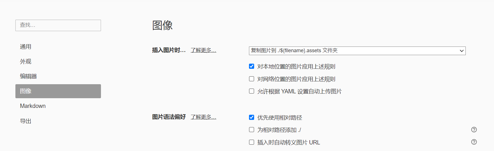
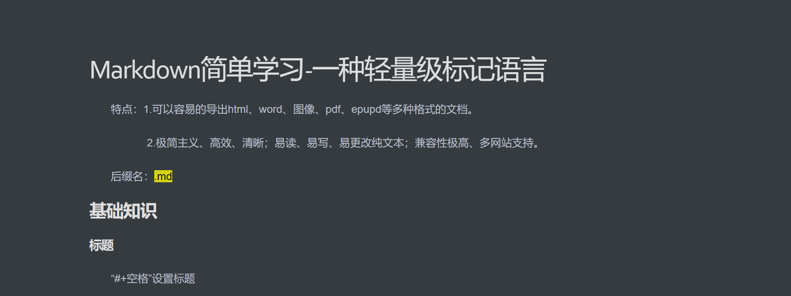
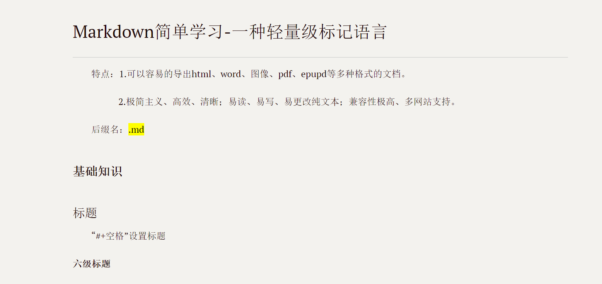
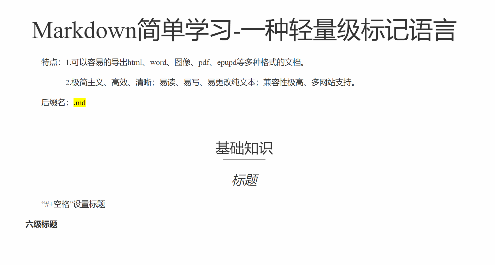
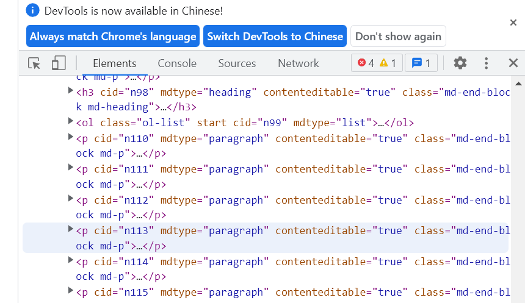
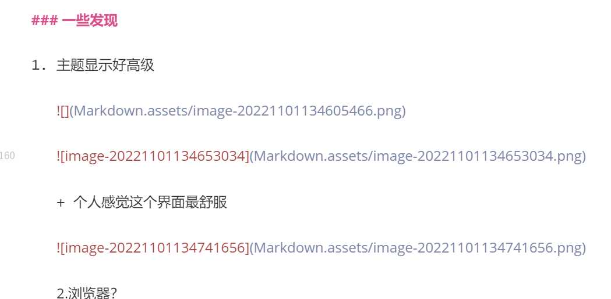

# Markdown简单学习-一种轻量级标记语言

特点：1.可以容易的导出html、word、图像、pdf、epupd等多种格式的文档。

​            2.极简主义、高效、清晰；易读、易写、易更改纯文本；兼容性极高、多网站支持。

后缀名：==.md==

## 工作原理

* Markdown 格式书写时，文本内容存储在带有 .md 或 .markdown 扩展名的纯文本文件中。简单来说，需要一个能够处理 Markdown 文件的 Markdown 应用程序。（有许多应用程序可供选择，从简单的脚本到类似于 Microsoft Word 的桌面应用程序。尽管它们在视觉上有所不同，但所有应用程序都执行相同的操作。）

* Markdown 应用程序使用一种称为 Markdown 处理器（也通常称为“解析器”或“实现”）的东西将获取到的 Markdown 格式的文本输出为 HTML 格式。此时，可以在 Web 浏览器中查看你的文档，或者将其与样式表组合并打印。


## 基础知识

### 标题

“#+空格”设置标题

###### 六级标题

### 引用

">"

> 鲁迅说过...
>
> > 再进行一次实现引用嵌套

### 列表设置

有序列表：

1.  操作一
2.  操作二

无序列表：

- +、-或*设置无序列表
- 

任务列表：

- [x] -空格[ ] 制作
- [ ] 


### 代码块

```c
int main()
{
    printf("Hello world!\n");
    return 0;
}
```

三个` +代码语言

### 数学公式

$$\frac{\partial f }{\partial x}=2\sqrt{a}x$$

4个$中间+数学公式

### 表格

| Geek | 前端 | 游戏 | 后端 | 产品 |
| :--- | ---- | ---- | ---- | ---- |
|      |      |      |      |      |

‘|’制作表格，|:-|左对齐，|：---|右对齐，|：-：|居中对齐

### 脚注

[]中加^和内容

2[^ 2]

### 横线、分割线

---

‘---’或‘***'制作横线

---

***

 

### 链接

[ 百度 ](baidu.com"标题“)

引用链接

[ 百度 ](id)

[id]：baidu.com

链接到标题[标题](#标题)

### 图片


方法

### 其他基础运用

*斜体*  一对*包裹

 **加粗**  两对*包裹

'编写行内代码' 

<u>下划线</u> <u></u>（Markdown中可以使用html实现Markdown不支持的内容）

:small_airplane:  :+表情名称

:cry:

~下标~    ~包裹      H~2~O

^上标^    ^包裹   X^2^

==高亮==    两对=包裹

~~删除~~    两对~~包裹

目录 \[toc]     但是我实现不了，还没有找到原因


# Typora探索

## 基本操作

### 图像设置



图片保存——文档与图片的分离

### 常用快捷键

| 快捷指令 |    快捷键    |   快捷指令   |    快捷键    |
| :------: | :----------: | :----------: | :----------: |
| 一级标题 |    Ctrl+1    |     段落     |    Ctrl+0    |
| 二级标题 |    Ctrl+2    | 提升标题级别 |    Ctrl+=    |
|  代码块  | Ctrl+shift+K | 降低标题级别 |    Ctrl+-    |
|  公式块  | Ctrl+shift+M |     引用     | Ctrl+shift+Q |
| 有序列表 | Ctrl+shift+[ |   偏好设置   |    Ctrl+,    |
| 无序列表 | Ctrl+shift+] |   任务列表   | Ctrl+shift+X |


### 支持的html元素

<kbd> <b> <i> <em> <sup> <sub> <br>        等

### 一些发现

1. 主题显示好高级

   

   

   + 个人感觉这个界面最舒服

   

   2.浏览器？

   
   
   3.源代码模式
   
   
   
   ## 
