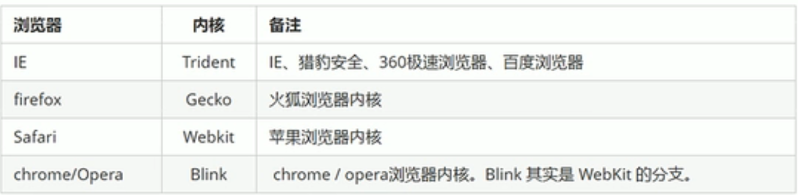
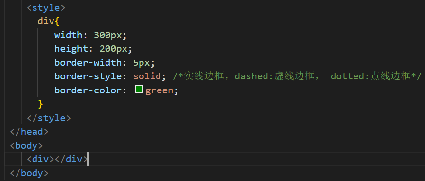

# Web基础

## 学习背景

初始前端，掌握Web相关基础知识有利于后期的学习与非前端开发人员了解制作网页的相关知识。

## 目录

[HTML](#HTML)

[CSS](#CSS)

[JavaScript基础](#JavaScript基础)

[Mackdown原理](#Markdown原理)


## :camel:HTML

超文本标记语言，网页其实就是一个HTML文件

> HTML通过 1.标签：描述将在网页上显示的信息（文字、图片、动画、声音...）
>
> ​                    2.浏览器：解释HTML代码，将信息展示给浏览者

​                                  浏览器内核（渲染引擎）：负责读取网页内容，整理讯息，计算网页的显示方式并显示页面。



Web标准：不同浏览器解析出来的效果可能不一致，如果没有一个标准，开发者需要为多版本的开发重复工作。W3C组织和其他标准化组织制定的Web标准减轻了工作量。主要包括结构（HTML）、表现（CSS）、行为（JS ...）。

#### :cactus:初识HTML

##### 扩展名：.html 或 .htm

##### HTML文档的标签及其属性的主要规则

1.标签的开始与结束：<标签名>、</标签名>

``` html
<h3>标题3文本</h3>
```

2.成对标签（容器），一对标签中可嵌套其他标签

```html
<h3><a href="http://www.baidu.com">百度</a></h3>
```

3.单独标签（空标签）不需要与之配对的结束标签(单标签的数量很少)

```html
<br>或<br/>
```

4.属性设置的一般格式：属性名=属性值，其中，属性值部分可以用英文""或''引起来，也可以不使用任何引号

```html
<a herf="http://www.baidu.com"id='menu'class=d>百度</a>
```

5.标签名及属性名不区分大小写

#### :cactus:HTML文档的基本结构

一个基本的HTML网页由以下几部分组成

1.文档头信息声明（不属于文档标签）

```html
<DOCTYPE html>
```

> 作用：必须放在第一行，用于告诉浏览器文档所用的HTML规范

2.根标签

```html
<html></html>
```

> 作用：说明本页面是由HTML编写的，使浏览器能够准确地解释和显示

3.头部标签

```html
<head></head>
```

> 头部标签不显示在网页中，在此标签内可以包含其他一些标签，用于说明文件标题和整个文件的一些公用属性

4.字符编码

```html
<meta charset="utf-8">
```

> uft-8(万国码)是最常用的字符编码格式

5.网页标题标签

```html
<title></title>
```

> 它包含的内容显示在浏览器的窗口标题栏中，如果没有title,标题栏将显示本页的文件名

6.网页主体标签 

```html
<body></body>
```

> 网页的实际内容包含其中，显示在浏览器窗口的客户区中
>
> 网页中的文字、图片、超链接以及其他的HTML相关的内容都定义在标签中

7.lang语言

* en定义语言为英语
* zh-CN定义语言为中文

```html
<html lang="en"></html>
```

基本结构

```html
<DOCTYPE html>
<html>
 <head>
    <meta charset="utf-8">
    <title>第一个页面</title>
 </head>
 <body>
    李明霞
 </body>
</html>
</DOCTYPE>
```


* 快速生成页面骨架结构更方便：==输入！按Tab键==
* 页面浏览：单击鼠标右键，点击“Open in Default Browser”

#### :cactus:HTML常用标签

* 标题标签  <h1>...<h6>共六级
* 段落标签  <p>段落</p>
* 换行标签  <br/>(强制换行了)
* 文本格式化标签  

| 语义   | 标签                       |
| ------ | -------------------------- |
| 加粗   | <strong></strong>或<b></b> |
| 倾斜   | <em></em>或<s></s>         |
| 删除线 | <del></del>或<s></s>       |
| 下划线 | <ins></ins>或<u></u>       |

> 这四种文本格式化标签更推荐前者（语义更强烈）

* ```html
  <div>和<span>标签
  ```

  > 这两个标签没有语义，相当于一个盒子，用于装内容
  >
  > 特点：1. div用来布局，一行只能放一个div(大盒子)
  >
  > ​            2. span用来布局时，一行可放多个span（小盒子）

  实例：

```html
<DOCTYPE html>
<html>
 <head>
    <meta charset="uft-8">
    <title>一些喜欢的句子</title>
 </head>
 <body background="https://p5.itc.cn/images01/20210817/f2da37fa1e3648eba827269fbb450e79.jpeg">
   <h3>《天堂旅行团》经典语录</h3>

    <p>1、这世界不停开花,我想放进你心里一朵。</p><br/>

    <p>2、有个女孩跟我说，世界是有尽头的。在南方洋流的末端，冰山漂浮，云和水一起冻结。</p>

　　<p>3、月亮永远都在，悬挂于时间长河之中。我从前一天来，要找的人是你。你往后一天去，不是我要找的人了。</p>

　　<p>4、天堂没有旅行团，我在世界尽头张望，等你回来，全人类睡得正香......</p>

　　<p>5、遇见你，就像跋山涉水遇见一轮月亮，以后天黑心伤，就问那天借一点月光。</p>

　　<p>6、孤独来自于生命中那些重要的人，他们的影子扎根在旧时光，笑容不知道去了何方。</p>

 </body>
</html>
</DOCTYPE>
```


  #### :cactus:HTML文档主体标签

文件主体是HTML文件的主要部分与核心内容，它包含文件所有的实际内容和绝大多数的标签符号

1.基本格式

```  html
<body>
    网页的内容
</body>
```

body标签还可以设置一些属性，对网页进行一些整体的设置

|         属性         |      用途      |               示例               |
| :------------------: | :------------: | :------------------------------: |
|  <body bgcolor="#R"  |  设置背景颜色  |       <body bgcolor="blue"       |
| <body background="R" |  设置背景图片  | <body background="images/bg.jpg" |
|   <body text="#R"    |  设置文本颜色  |    <body text="#FF0000"(红色)    |
|   <body link="#R"    | 设置超链接颜色 |        <body link="green"        |

#### :cactus:HTML图像标签

```html

```

|  属性  |  属性值  |                   说明                   |
| :----: | :------: | :--------------------------------------: |
|  src   | 图片路径 |                 必须属性                 |
|  alt   |   文本   |      替换文本，图像显示不了时的替换      |
| title  |   文本   | 提示文本，当鼠标放在图像上，显示文字提示 |
| width  |   像素   |               设置图像宽度               |
| height |   像素   |               设置图像高度               |
| border |   像素   |             设置图像边框粗细             |

注意：src是必须要写的，所有属性必须放在img后面，设置图像标签时需将图片与html文本放在同一个文件夹内

##### 图像标签及路径

绝对路径：是指目录下的绝对位置，直接到达目标位置，通常是从盘符开始的路径。（1.图像在电脑中具体的哪一个位置，只对于个人电脑，很少使用。2.网络地址，但是网络上图片删除，就不能显示了）

相对路径：以引用文件所在位置为参考基础，所建立的目录路径

| 相对路径分类 | 符号 | 说明                                                  |
| ------------ | ---- | ----------------------------------------------------- |
| 同一级路径   |      | 图像位于HTML文件同一级 <imag src="baidu.gif"/>        |
| 下一级路径   | /    | 图像位于HTML文件下一级 <imag src="images/baidu.gif"/> |
| 上一级路径   | ../  | 图像位于HTML文件上一级 <imag src="../baidu.gif"/>     |

体会：绝对路径是"\",相对路径是"/",  路径可以类比学过的C、C++中文件操作

#### :cactus:超链接标签

<a>：将一个页面链接到另一个页面

* 语法规范

  ```html
  <a herf="跳转目标"target="目标窗口的弹出方式">文本或图像</a> //target用于指定链接页面的打开方式，_self为默认值，_blank为在新窗口中打开
  ```

* 链接分类

  1. 外部链接 :必须以"http://"开头

     ```html
     <a herf="http://www.baidu.com"target="_self">名称</a>
     ```

     

  2. 内部链接：内部网站页面之间的相互链接，直接链接到内部页面名称即可。

     ``` html
     <a herf="跳转目标"名称</a>
     ```

     c.空链接：没有确定链接目标时

     ```html
     <a herf="#">名称</a>
     ```

     d.下载链接：如果herf地址里面是一个文件或者压缩包，会下载这个文件

     ```html
     <a herf="跳转目标"下载文件</a>
     ```

     e.网页元素链接：文本、图像、表格、视频、音频等都可以添加超链接

     f.锚点链接：电连接后，可以快速定位到页面中的某个位置。

     ```html
     <a herf="#起一个链接名">名字</a>
     <h2 id="上面刚刚写的链接名">名字对应内容</h2>
     ```

#### :cactus:注释标签和特殊字符

* 注释：以"<!--"开头，"-->"结束，注释内容是给程序猿看的，不执行不显示，良好的编程习惯

* 特殊字符：

  ```html
  空格   &nbsp;            ￥     &yen;
  <     &lt;              版权符  &copy;
  >    &gt;               注册商标 &reg; 
  &    &amp;              摄氏度   &deg;
  正负号  &plusmn;         乘号    &times;
  除号   &divide;          平方    &sup2;
  立方   &sup3;             ...
  ```

#### :cactus:块级元素与内联元素

##### :sake:块级元素：每个块级元素通常都会独占一行或者是多行，可以对其单独设置高度,宽度以及对齐等属性。

特点：

* 一个块级元素独占一行

* 高度，行高，外边距和内边距都可以单独设置

* 宽度默认是容器的100%

* 不解析换行符

* 可以容纳内联元素和其他的块级元素

* 常用的块级元素：

  ```html
  <div>、<p>、<nav>、<aside>、<header>、<footer>、<section>、<article>、<h1>...<h6>、<ol>、<ul>、<dl>(定义列表)、<table>、<address>、<blockquote>、<form>
  ```

##### :sake:内联元素：不占有独立的区域，仅依靠自己的字体大小或者是图像大小来支撑结构。

特点：

- 和相邻的行内元素在一行上，遇到父级元素边界会自动换行

- 高度、宽度、顶部底部边距不可设置，但是水平方向上的padding和margin可以设置，垂直方向上的无效

- 默认的宽度就是它本身的宽度

- 行内元素只能容纳文本或者是其他的行内元素（a标签除外）

- 换行符会被解析

- 常用的内联元素：

  ```html
  <a>、<span>、<b>、<br>、<i>、<em>、<strong>、<label>、<q>
  ```

##### :sake:行内块级元素

特点：

- 和相邻的行内元素（行内块）在一行上，但是中间会有空白的间隙

- 默认的宽度就是本身内容的宽度

- 高度，宽度、行高，内边距和外边距都可以设置

- 换行符会被解析

- 常用行内块级元素：

  ```html
  、<input>
  ```

##### :sake:显示模式转换:

块转行内：display-inline；

行内转块：display：block；

块，行内元素转换为行内块：display：inline-block ；float:left / right；position：absolute/fixed

## :camel:CSS

HTML有一定的局限性，HTML只关注内容的语义，显示网页元素；HTML可以做简单的样式，但是会带来无尽的臃肿和繁琐。CSS做样式、HTML专注于结构呈现，即结构与样式相分离。

CSS是层叠样式表的简称，也称为CSS样式表或级联样式表。也是一种标志语言。

* 使用场景：美化网页、布局页面（美容师）
* 主要用于设置HTML页面中的文本内容（字体、大小、对齐方式...)、图片的外形（宽高、边框样式、边距...)、版面的布局和外观的显示样式

#### :cactus:CSS语法规范

##### :sake:CSS样式规则

主要由两个部分构成：==选择器==及一条或多条==声明==

* 选择器用于指定CSS样式的HTML标签，花括号内是对对象设置的具体样式。属性与属性值之间以“键值对”的形式出现。

  ```css
  <style>
  p {
      color: red;
      font-size: 12px; <!--修改文字大小为12像素-->
  }
  </style>
  ```

##### :sake:CSS代码风格

1. 样式格式：紧凑格式、展开格式（推荐）

2. 样式大小写：小写字母，特殊情况另做讨论

3. 空格规范：a.属性值前面，冒号后面，保留一个空格

   ​                     b.选择器（标签）和大括号中间保留空格

#### :cactus:CSS基础选择器

##### :sake:选择器的作用

选择器（选择符）就是根据不同需求把不同的标签选出来，即选择标签用的

分类：

* 基础选择器：单个选择器组成

  包括标签选择器、类选择器、id选择器、通配符选择器

* 复合选择器

##### :sake:基础选择器

###### 标签选择器（元素选择器）

用HTML标签名称作为选择器

* 可以把某一类标签全部选择出来，比如所有的<span>
* 优点：能快速为页面中同类型的标签统一设置样式
* 缺点:不能设计差异化样式，只能选择全部的当前样式
* 语法：

```css
<style>
p {
    color: green;
}
div {
    color: pink;
}
</style>
```

###### 类选择器

* 单独选一个或某几个标签（使用最多）

* 语法:

  ```html
  <style>
    .red {   <!--样式点定义,命名不能与标签名一样，尽量使用英文来表示-->
        color: red;
    }
  </style>
  
  <li class="red"></li>  <!--结构class调用-->
  ```

类选择器——多类名

* 我们可以给一个标签指定多个类名，从而达到更多的选择目的。这些类名都可以选出这个标签。可以理解为一个标签有多个名字。

* 使用场景：把一些标签元素相同的样式放到一个类里面。这些标签都可以调用这个公共的类，然后再调用自己独有的类。既节省代码，统一修改也非常方便。

* 使用方式：

  ```html
  <style>
    .red {
        color: red;
    }
     .font35{
         font-size: 35px; 
     }
  </style>
  <body>
      <div class="red fond35">Geek</div>  <!--多个类名中间必须用空格分开,这样即可同时具有这些类名的样式-->
  </body>
  ```

  ###### id选择器

  * id选择器可以为标有特定id的HTML元素指定特定的样式
  * id是一次性的，只能调用一次
  * 语法

  ```html
  #id名{
      属性1：属性值1；
    ...
  }
  ```

  ```html
  <style>
      #pink{  
          color: pink;
      }
  </style>
  <body>
      <div id="pink">
          内容
      </div>
  ```

  > 类选择器（class)就好比是人的名字，一个人可以有多个名字，同时一个名字可以被多个人使用。
  >
  > id选择器就好比人的身份证号码，是唯一的。
  >
  > 两个选择器的使用次数不同，类选择器在修改样式中用的最多，id选择器一般用于页面唯一性的元素上，经常和JS一起搭配使用。

  ###### 通配符选择器

  * 使用"*"定义，表示选取页面中所有的元素
  * 通配符选择器不需要调用，自己就给所有的元素使用样式。特殊情况下才使用。
  * 语法：

  ```html
  <style>
      *{  
          color: pink;   <!--这里所有标签都改为了粉色-->
      }
  </style>
  ```

#### :cactus:字体属性

##### :sake:字体系列

* CSS使用font-family属性定义文本的字体系列
* 各种字体之间必须使用英文状态下的逗号隔开，若字体由多个单词组成，加引号

```css
body{
    font-family: "Times New Roman",Times,serif;
}
```

##### :sake:其他字体属性

|      类别      |                             属性                             |                             注意                             |
| :------------: | :----------------------------------------------------------: | :----------------------------------------------------------: |
|    字体大小    |                          font-size                           |              标题标签比较特殊，需要单独指定大小              |
|    字体粗细    |                         font-weight                          | 数字后面没有单位，normal 默认值（等同于400），bold 粗体（等同于700） |
|    文字样式    |                          font-style                          |                 italic:倾斜，normal：不倾斜                  |
| 字体的复合属性 | font：font-style  font-weight font-size/line-height  font-family | 顺序不能调换,各属性空格隔开，必须保留size和family，其他可省略（默认值） |
|                |                                                              |                                                              |

```css
P{
   font-size: 16px；
   font-weight: 700;  
   font-style: normal；
   font: italic 700 16px  "Times New Roman";
}
```

#### :cactus:文本属性

##### :sake:文本颜色

* color属性用于定义文本的颜色

* 表示方式：

  预定义颜色值：red,green,blue,pink...

  十六进制：#FF0000,#FF6600,#29D794(用的最多)

  RGB代码：rgb(255,0,0)或rgb(100%,0%,0%)

```css
div{
    color: red;
    color: #cc00ff;
    color: rgb(255,0,0);
}
```

##### :sake:其他文本属性

| 类别     | 属性              | 注意                                                         |
| -------- | ----------------- | ------------------------------------------------------------ |
| 对齐文本 | text-align        | 默认left左对齐                                               |
| 装饰文本 | text-decororation | 默认none，没有装饰线，underline,overline,line -through       |
| 文本缩进 | text-indent       | 文本的第一行缩进多少，em是一个相对单位，1em相对文本一个文字大小的距离。 |
| 行间距   | line-height       | 行间距=上间距+文本高度+下间距                                |

```css
div{
    text-align: center;
    text-decororation: underline;
    text-indent: 20px;
    line-height: 26px;
}
```

#### :cactus:CSS的引入方式——样式表

##### :sake:内部样式表

* 内部样式表是写到html页面内部。将所有的css代码抽取出来，单独放在<style>标签中。<style>一般会放在<head>中。
* 通过这种方式，可以方便控制当前整个页面中的元素样式设置。
* 代码结构清晰，但是并没有实现结构与样式的完全分离。

##### :sake:行内样式表

* 在元素标签内部的style属性中设定CSS样式，适合与修改简单样式。
* 通过这种方式，双引号，可以控制当前的标签设置样式。

```css
<p style-"color: red;">内容</p>
```

##### :sake:外部样式表

* 样式单独写在CSS文件中，之后使用link标签引用到HTML文件中（实际开发中常用）

```css
<link rel="stylesheet" herf="css文件路径">
```

#### :cactus:emmet语法

前身是Zen coding,使用缩写，提高HTML、CSS编写速度

1.快速生成HTML结构语法

|          功能           |                             代码                             |
| :---------------------: | :----------------------------------------------------------: |
|        生成标签         |                          标签+Tab键                          |
|    生成多个相同标签     |                          标签*数量                           |
|       父子级标签        |                  用>，比如：ul>li(ul包含li)                  |
|      兄弟关系标签       |                     用+，比如div+p(同级)                     |
|  生成带有类名或id名的   | 直接写.demo或#two +Tab（默认生成div,若要生成其他，在前面加标签名，比如：p.nav) |
| 生成的div类名是有顺序的 |                  用自增符号，比如：.demo$*5                  |
| 在生成的标签内部写内容  |                 用{}表示，比如：div{内容}*3                  |

2.快速生成CSS样式语法

简写+Tab:比如：text-align: center直接输入tac

#### :cactus:盒子模型

##### :sake:网页布局

页面布局三大核心：盒子模型、浮动、定位

每个网页都是由许多盒子组成的，网页布局的核心就是摆盒子

网页布局过程：

1. 先准备好相关的网页元素，网页元素基本都是盒子
2. 利用CSS设置好盒子样式，然后摆放在相应的位置
3. 往盒子里面装内容

##### :sake:盒子模型组成

就是把HTML页面中的布局元素看做是一个矩形的盒子，用来盛装内容。CSS盒子模型本质上就是一个盒子，封装周围的HTML元素，它包括：边框、外边距、内边距和实际内容


* 边框（border)



边框的复合写法：

```css
border: 1px solid red; <!--没有顺序-->
```

边框分开写：


层叠性设置三条边为粉色，一条边为绿色：

* 内边距（padding)：内容和边框的距离：

内边距复合性写法：pading后一个值：上下左右；两个值：上下、左右；三个值：上、左右、下；四个值：上右下左（顺时针）

> 边框和内边距会影响盒子的实际大小,测量盒子大小时，不量边框，如果包含了边框，则需要减去边框。减去多出来的内边距大小。

eg:导航栏


* 外边距（margin)

控制盒子与盒子之间的距离,简写与padding一样


* 外边距的典型运用：实现块级盒子水平居中：盒子必须指定宽度，左右外边距设置为auto
* 行内元素或者行内块元素实现水平居中给其父元素添加text-align:center即可
* 外边距合并

使用margin定义块元素的垂直外边距时，可能会出现外边距的合并。（嵌套块元素垂直外边距的塌陷

> 解决方案
>
> > * 为父元素定义上边框
> > * 为父元素定义上内边距
> > * 为父元素添加overflow:hidde
> > * 其他：浮动、固定、绝对定位

#### :cactus:position定位

* 浮动可以让多个块级盒子一行没有空隙排列显示，经常用于横向排列盒子。
* 定位则是可以让盒子自由的在某个盒子内移动位置或者固定屏幕中某个位置，并且可以压住其他盒子。

##### :sake:定位组成

定位=定位模式（用于指定一个元素在文档中的定位方式）+边偏移（决定该元素的最终位置）

###### :sake:定位模式

* 静态定位（static)

是元素默认的定位方式，无定位的意思。静态定位按照标准流特性摆放位置，它没有边偏移，在布局中很少用到。

语法：

```css
选择器 { position: static;}
```

* 相对定位(relative)

是元素在移动位置的时候，相对于它原来的位置来说的。原来在标准流的位置继续占有，后面的盒子仍然以标准流的方式对待它。（不脱标，继续保留原来的位置）

语法：

```css
选择器 { position: relative;}
```


* 绝对定位(absolute)

是元素在移动位置的时候，是相对于祖先元素来说的。如果父元素不存在或父元素没有定位，则以浏览器为准定位。如果父元素有定位，则以==最近一级==的有定位的父元素为参考点移动位置。也就是子元素在父盒子里面走。绝对定位不再占有原先的位置。（脱标，原先的位置不再保留）

语法：
```css
选择器 { position: absolute; }
```

> 相对定位和绝对定位的使用场景：子绝父相（父级需要占有位置，因此是相对定位，子盒子不需要占有位置，则是绝对定位
>
> > 子集绝对定位，不会占有位置，可以放到父盒子里面的任何一个地方，不会影响其他的兄弟盒子。
> >
> > 父盒子需要加定位限制子盒子在父盒子内显示。
> >
> > 父盒子布局时，需要占有位置，因此父亲只能是相对定位。

* 固定定位(fixed)

是元素固定于浏览器可视区的位置，主要使用场景：可以在浏览器页面滚动时元素是位置不会改变。以浏览器的可视窗口为参照点移动元素，跟父元素没有任何关系；不随滚动条滚动。固定定位不占有原先的位置，（脱标的，可以看做是一种特殊是绝对定位。

语法：

```css
选择器 {position: fixed;}
```

* 粘性定位（sticky)

可以理解为是相对定位和固定定位的混合。特点有：以浏览器的可视窗口为参照点移动元素；占有原先的位置；必须添加top、left、right、bottom其中一个才有效。跟页面滚动搭配使用较多，兼容性较差，IE不支持。

语法：

```css
选择器 { position: sticky;}
```

###### :sake:边偏移

有top、bottom、left、right四个属性

###### :sake:定位的叠放次序

使用定位布局时，可能会出现盒子重叠的情况。可以使用z-index来控制盒子的前后次序。

```css
选择器 { z-index: 1;}
```

* 数值只要是整数即可，默认auto，数值越大，盒子越靠上
* 如果属性值相同，则按照书写顺序，后来居上
* 数字后面不能加单位
* 只有定位的盒子才有z-index属性

#### :cactus:浮动

```css
选择器 { float：right/left/none；}
```

######  :sake:传统网页布局的三种方式

* 普通流（标准流/文档流）
* 浮动
* 定位

浮动最典型的应用：可以让多个块级元素一行内排列显示

> 网页布局第一准则：多个块级元素纵向排列找标准流，多个块级元素横向排列找浮动。

###### :sake:浮动特性

* 浮动元素会脱离标准流控制（脱标）——漂浮在普通流的上面，不再保留原先的位置
* 如果多个盒子都设置了浮动，则它们会按照属性值一行内显示并且顶端对齐排列（浮动的元素是相互贴靠在一起的，如果父级宽度装不下这些浮动的盒子，多出的盒子会另起一行对齐）
* 浮动元素会具有行内块元素特性，任何元素都可以浮动，不管原先是什么模式的元素，添加浮动之后具有行内块元素相似的特性（如果行内元素有了浮动，则不需要转换块级、行内块元素就可以直接给高度和宽度

浮动元素经常和标准流父级搭配使用，以此约束浮动元素位置


eg:


####  :cactus:常见网页布局


* 头部区域：一般用于设置网页的标题或者网页的logo
* 菜单导航条：包含一些链接
* 底部区域：一般包含版权信息和联系方式等

eg:

```html
<DOCTYPE html>
<html>
 <head>
    <meta charset="utf-8">
    <meta name="viewport" content="width=device-width,initial-scale=1">
    <meta http-equiv="X-UA-Compatible" cotent="ie=edge">
    <title>浮动元素搭配标准流</title>
    <style>
        * {
            margin: 0;
            padding: 0;
        }
        li {
            list-style: none;
        }
        .top {
            height: 50px;
            background-color: gray;
        }
        .banner {
            width: 980px;
            height: 150px;
            background-color: gray;
            margin: 10 auto;
        }
        .box {
            width: 980px;
            margin:0 auto;
            height: 300px;
            background-color: pink;
        }
        .box li {
            float: left;
            width: 237px;
            height: 300px;
            background-color: gray;
            margin-right: 10px;
        }
        .box .last {
            margin-right: 0;
        }
        .footer{
            height: 200px;
            background-color: gray;
            margin-top: 10px;
        }

    </style>
 </head>
 <body>
    <div class="top">top</div>
    <div class="banner">banner</div>
    <div class="box">
        <ul>
            <li>1</li>
            <li>2</li>
            <li>3</li>
            <li class="last">4</li>
        </ul>
    </div>
    <div class="footer">footer</div>
 </body>
</html>
</DOCTYPE>
```


####  :cactus:CSS的伪类

> 添加一些选择器的特殊效果

语法：

```css
selector:pseudo-class {property:value;}
```

使用场景：1. 设置鼠标悬停在元素上时的样式 。   

​                    2.为已访问和未访问链接设置不同的样式 。   

​                    3.设置元素获得焦点时的样式 。

* anchor锚（动态）伪类选择器

  没有时间做笔记了，后期一定学习补上

### :camel:JavaScript基础

#### :cactus:基本语法

1. JS严格区分大小写

2. JS与c一样，每一条语句都要用分号隔开

3. JS会忽略多个空格和换行，我们可以利用空格、换行对代码进行格式化

4. 标识符（变量、函数、属性的名字；函数的参数）：规则与c也有很多的相似之处

   * 可以含有字母、数字、_、$
   * 不能以数字开头，不能是ES中的关键字或保留字
   * 一般采用驼峰命名法：首字母小写，每个单词的开头字母大写，其余小写

5. 数据类型

   js一共有String、Number、Boolean、Null、Undefined基本数据类型和Object引用数据类型

   * String:必须用单引号或双引号引起来，引号不能嵌套使用，表示一些特殊符号时可以使用\转意字符进行转意（规则与c相似）
   * Number:JS中所有数值都是Number类型
   * Boolean(逻辑值/真假值类型)
   * Null
   * Undifined:typeof对没有初始化和没有声明的变量都会返回undefined

6. 运算符（与c相似）

##### :cactus:前端三件套之间的关系

前面我们也有总结过，HTML仅仅关注内容的语义，显示网页元素；HTML可以做简单的样式，但是会带来无尽的臃肿和繁琐。CSS专注于控制网页的外观样式，这样可以使我们的页面更加美观、简洁。JS则是一种脚本语言，它嵌入在HTML页面中，由浏览器一边解释一边执行，它可以使静态的HTML具有一定的交互效果，比如轮播、弹窗...我在视屏上看到过有人把他们的关系比作一只小鸟，HTML是鸟的身体，CSS是鸟漂亮的羽毛，JS则是让鸟飞起来。从这个比喻我们可以理解，三者中HTML是最关键的部分，但CSS、JS的加入使得由丑变美、由静变动。

#### :camel:Markdown原理

说实话，之前对Mackdown的原理不是很理解，之前看网站上是这么说的。


类似于三件套，HTML书写内容存储在html文本中，JS相当于解析器解释和执行内容，显示在浏览器上。Mackdown的原理与之类似，Mackdown负责纯文本内容的存储，再靠与Typora这类型的软件充当解析器输出来实现。


### :camel:参考资料

[黑马前端基础课](https://www.bilibili.com/video/BV14J4114768/?spm_id_from=333.999.0.0)

[CSDN良雨 块级元素、内联元素](https://blog.csdn.net/qq_34821198/article/details/91359274?spm=1001.2014.3001.5502)

[CSS position 菜鸟教程](https://www.runoob.com/css/css-positioning.html)

[网页布局 菜鸟教程](https://www.runoob.com/css/css-website-layout.html)

Web前端开发案例教程


