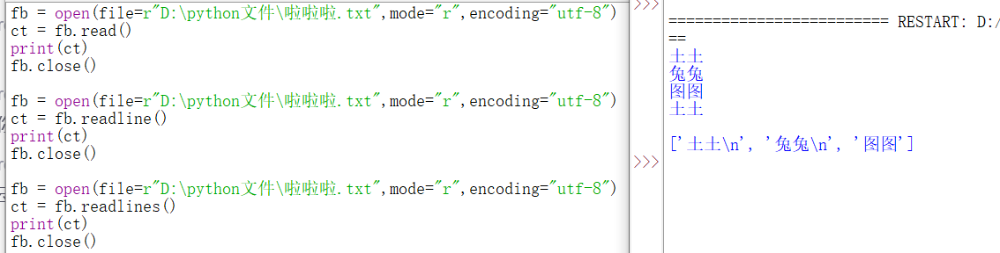

# :camel:python

## 目录

[基础](#基础)

[面向对象程序设计](#面向对象程序设计)

[爬取网站资源](#爬取网站资源)

[反爬机制](#反爬机制)

## :pear:基础

### :cactus:语法

注释：#开头，多行注释以多个#开头，或者'''和"""

保留字：keyword.kwlist查看

缩进：缩进来表示代码块，同一个代码块缩进空格数需相同

多行语句：\实现多行语句，如果多行语句在{}、[]、或（）中，不需要\

空行：\n

同一行显示多行语句，用；隔开

### :cactus:变量

类比c语言（与c语言相似），通常由字母、数字和下划线构成，但不能以数字开头。phthon3支持中文变量名。

### :cactus:字符串

基本用法类比c语言,单引号、双引号括起来.

1.转义字符

（与c相似，当字符串中存在单双引号时可使用转义字符避免出现错误）

2.原始字符

在字符串的第一个引号前加一个r,原始字符使转义字符不再有效。


3.长字符串

实现跨行字符串，用三个单引号或三个双引号包裹。

~~~python
p = """
la
la
"""
~~~

4.字符串的加法和乘法

使用加法进行拼接，乘法进行复制。


### :cactus:数据类型

标准数据类型：Number、string、List、Tuple、Set、Dictionary

#### 数字类型(Number)

1.浮点数、整数、复数

2.运算

|      操作      |         结果         |
| :------------: | :------------------: |
|     x // y     | 地板除 ,相除向下取整 |
|     abs(x)     |    返回x的绝对值     |
|     int(x)     |     x转化为整数      |
| complex(re,im) |     返回一个复数     |
| c.conjugate()  |   返回c的共轭复数    |
|  divmod(x,y)   |   返回（x//y,x%y)    |
|    pow(x,y)    |       x的y次方       |
|     x ** y     |     计算x的y次方     |

#### 列表（List)

写在方括号 **[]** 之间、用逗号分隔开的元素列表。(数组？)


#### 元祖（Tuple)

写在（）内，元素之间用逗号相隔

~~~python
tup1 = ()                 #空元祖
tup2 = (20,)              #一个元素，需要在元素后添加逗号
print (tuple)             # 输出完整元组
print (tuple[0])          # 输出元组的第一个元素
print (tuple[1:3])        # 输出从第二个元素开始到第三个元素
print (tuple[2:])         # 输出从第三个元素开始的所有元素
print (tinytuple * 2)     # 输出两次元组
print (tuple + tinytuple) # 连接两个元组
~~~

注意：

* 字符串与元祖元素不能修改。
* 元祖也可以被索引与切片。
* 元祖也可以用+连接。

#### 集合（Set）

用大括号 **{ }** 或者 **set()** 函数创建集合，且创建一个空集合必须用set()

~~~python
p = {v1,v2....}
set（v）
~~~


#### 字典（Dictionary)

字典是一种映射类型，用 **{ }** 标识，是一个无序的 **键(key) : 值(value)** 的集合。(区别与列表，列表是有序的对象集合)在同一个字典中，Key必须是唯一的。


#### 数据类型转换

|        函数        |                     含义                     |
| :----------------: | :------------------------------------------: |
|       str(x)       |               将x转换为字符串                |
|      repr(x)       |              转换为表达式字符串              |
|    eval（str）     | 计算字符串中有效Python表达式，并返回一个对象 |
| 数据类型名（序列） |            将序列转换为改数据类型            |
|      dict(d)       |                 创建一个字典                 |
|       chr(x)       |                整数转换为字符                |
|       ord(x)       |               字符转换为整数值               |
|                    |             整数转十六进制字符串             |
|       oct(x)       |              整数转八进制字符串              |


### :cactus:布尔类型


定义为false的对象：none和false

值为0的数字类型：0,0.0,0j,Decimal(0),Fraction(0,1)

空的序列和集合：",(),{},[],set(),range(0)

#### 布尔运算（逻辑运算）


eg:


### :cactus:短路逻辑

核心思想：从左往右，只有当第一个操作数的值无法确定逻辑运算的结果时，才对第二个操作数进行求值。


### :cactus:运算符优先级


### :cactus:分支和循环

#### 分支结构

~~~python
if condition：
    statement(s)
~~~

~~~python
if condition:
    statement(s)
else:
    statement(s)
~~~

~~~python
if condition1:
    statement(s)
elif condition2:
    statement(s)
...
~~~

```python
if condition1:
    statement(s)
elif condition2:
    statement(s)
...
else:
    statement(s)  #以上均不成立情况下执行
```

~~~python
条件成立时执行的语句 if condition else 条件不成立时执行的语句
~~~


分支结构的嵌套：可多层嵌套

#### 循环结构:while、for

~~~python
while condition:
    statement(s)
else:
    statement(s)
~~~

~~~python
for 变量 in 可迭代对象：
    statement(s)
~~~


#### range()

range(stop)

range(start,stop)

range(start,stop,step)   //Step用于指定跨度


跳出循环：break（跳出循环体）、continue（跳出本轮循环）

嵌套：break 与continue都只能作用于一层循环体

## :pear:面向对象程序设计-类比C++

### :cactus:类定义

~~~python
class Classname:
    <statement-1>
    ...
    <statement-N>
~~~

### :cactus:类对象

1.操作：属性引用（obj.name)和实例化

~~~python
class Mclass:
    i = 1234
    def f(self):
        return 'ok'
    
x = Mclass() #实例化并将该对象赋给局部变量 x
print（“类的属性 i 为：”，x.i）  
print（“类的方法 f 输出为：”，x.f())
~~~

2.构造方法（类比C++构造函数）

~~~python
def_init_(self):
    self.data = []
~~~

~~~python
class Complex:
    def __init__(self, realpart, imagpart):  #有参构造
        self.r = realpart
        self.i = imagpart
~~~

self代表类的实例,代表当前对象的地址，类的方法必须有一个额外的第一个参数名称，惯例为self，self不是python的关键字，换成其他也可以。self.class_:指向类。

###  :cactus:类的方法

使用def关键字来定义方法

### :cactus:继承

~~~python
class DerivedClassName(modname.BaseClassName): #子类的定义
class DerivedClassName(Base1, Base2, Base3):  #多继承，当几个父类方法同名时，默认调用的是在括号中参数位置排前父类的方法
~~~

操作与C++类似

~~~python
 Base._init_(self,n,a) #调用父类的函数：父类.父类的函数
 def speak(self)   #可直接覆写父类的方法
super(Child,c).myMethod() #用子类对象调用父类已被覆盖的方法(super() 函数是用于调用父类(超类)的一个方法)
~~~

### :cactus:类属性与方法

1.类的私有属性

~~~python
__private_attrs：#两个下划线开头，声明该属性为私有
 self.__private_attrs #在类内部的方法中使用，实例不能访问私有变量
~~~

2.类的私有方法

~~~python
__private_method：#私有方法，只能在类的内部调用 ，不能在类的外部调用
self.__private_methods
~~~

### :cactus:运算符重载


## :pear:文件操作

### :cactus:open函数

内置函数open()实现对文件的操作。python对文本文件和二进制文件采用的操作步骤：“打开—操作—关闭”

~~~python
打开文件：open（文件路径，打开模式，编写格式）
~~~

|   模式   |                             含义                             |
| :------: | :----------------------------------------------------------: |
| r(只读)  |          r为默认模式，文件一定要存在，否则会报错。           |
| w(只写)  | 1.如果文件不存在，会自动创建。2.文件所在的目录一定要存在，否则会报错。3.会覆盖原有内容。 |
| a(追加)  | 1.如果文件不存在，会自动创建。2.文件所在的目录一定要存在，否则会报错。3.若文件存在，则直接在文件末尾，继续追加内容。 |
| rb(只读) |         二进制方式读，其他一样。（通常用于打开图片）         |
| wb(只写) |         二进制方式写，其他一样。（通常用于打开图片）         |
| ab(追加) |        二进制方式追加，其他一样。（通常用于打开图片）        |

### :cactus:读文件

   

1.相对路径：一般是指相对当前脚本的路径。绝对路径：指定了文件在电脑中的具体位置。

2.with上下文管理：用于解决忘记关闭文件句柄，造成资源浪费。这样不再需要手动调用fs.close(),自动将文本关闭。

~~~python
with open(文件地址) as 函数名：
~~~

3.多种读文件的方式：

|    类型     |                        含义                        |
| :---------: | :------------------------------------------------: |
|   read()    | 读取文件的所有数据。默认从头开始，读取出来为字符串 |
| readline()  |                    读取一行数据                    |
| readlines() |    按行读取所有数据。结果为列表，一行为一个成员    |



### :cactus:写文件

~~~python
with open(file=r"D:\python文件\啦啦啦.txt",mode="r",encoding="utf-8") as fb:
    fb.write("新写入的内容\n")
#写二进制文件
import requests
 
url = '文件地址'
 
response = requests.get(url)
 
with open('图片.jpg', 'wb') as f:
    f.write(response.content)

~~~

### :cactus:tell方法

文件对象的tell方法返回整数，表示文件指针距离文件开头的字节数


### :cactus:seek方法

通过文件对象的seek 方法可以移动文件句柄

seek 方法接收两个参数：offset 表示偏移指针的字节数，whence 表示偏移参考，默认为 0

0 表示偏移参考文件的开头，offset 必须是 >=0 的整数。1 表示偏移参考当前位置，offset 可以是负数。2表示偏移参考文件的结尾，offset一般是负数。


## :pear:爬取网站资源

### :cactus:爬虫

爬虫：（网页蜘蛛、网络机器人）有时也被称为网页追逐者，是一种按照一定的规则，自动地抓取互联网上网页中相应信息（文本、图片等）的程序或脚本，然后把抓取的信息存储到自己的计算机上。


#### 爬虫合法性

在法律上不被禁止，具有违法风险。爬虫带来的风险：爬虫干扰了被访问网站的正常运营；爬虫抓取了受到法律保护的特定类型的数据或信息。

如何避免违法：时常优化程序，避免干扰被访问网站的正常运行；在使用，传播爬取到的数据时，审查抓取到的内容，如果发现涉及用户隐私、商业机密等敏感内容时，需要及时停止爬取或传播。

#### 爬虫分类

1.通用爬虫：抓取系统重要组成部分。抓取的是一整张页面数据。

2.聚焦爬虫：是建立在通用爬虫的基础之上，抓取的是页面中特定的局部内容。

3.增量式爬虫：检测网站中数据更新的情况。只会抓取网站中最新更新的数据。

### :cactus:http协议

概念：服务器和客户端进行数据交互的一种形式。

https协议：安全的超文本传输协议。

#### 常用请求头信息

User-Agent:请求载体的身份标识

Connection:请求完毕后，是断开连接还是保持连接

#### 常用响应头信息

Content-Type:服务器响应回客户端的数据类型

#### 加密方式

* 对称密匙加密
* 非对称密匙加密
* 证书密匙加密

### :cactus:requests

python中原生的一款基于网络请求的模块，功能非常强大，简单便捷，效率高。作用：模拟浏览器发送请求。

环境安装： pip install requests

使用：（编码流程）

* 指定url
  * UA伪装
  * 请求参数的处理
* 发送请求
* 获取响应数据
* 持久化存储

### :cactus:数据解析（处理聚焦爬虫需求）

#### 数据解析分类

* 正则
* bs4
* xpath

#### 数据解析原理

1.进行指定标签的定位

2.标签或者标签对应的属性中存储的数据值进行提取，解析

##### bs4原理：

1.实例化一个BeautifulSoup对象，并且将页面源码数据加载到该对象中

2.通过调用BeautifulSoup对象中相关的属性或者方法进行标签定位和数据提取

##### xpath解析原理：

1.实例化一个etree的对象，且需要将解析的页面源码数据加载到该对象中

2.调用etree对象中的xpath方法，结合xpath表达式实现标签的定位和内容的捕获

### :cactus:代理理论

代理：代理服务器。可破解封IP这种反爬机制

代理的作用：1.突破自身IP访问的限制

​                          2.隐藏自身真实IP

代理IP的类型：1.http：应用到http协议对应的url中

​                              2.https:应用到https协议对应的url中

代理IP的匿名度：

* 透明：服务器知道该次请求使用了代理，也知道请求对应的ip
* 匿名：知道使用了代理，不知道真实IP
* 高匿：不知道使用了代理，更不知道真实IP

## :pear:反爬机制

门户网站可以通过制定相应的策略或者技术手段，防止爬虫程序进行网站数据的爬取。

##### 一些反爬机制：

* rebots.tex协议：规定了网站中哪些数据可以被爬虫爬取，哪些不能。（君子协议，但也可以不遵守）
* 验证码：人工肉眼识别、第三方自动识别（eg:云打码）

反反爬策略：爬虫程序可以通过制定相应的策略或者技术手段，破解门户网站中具备的反爬机制，从而获取数据。

## :pear:参考资料

1.[Python3 教程 | 菜鸟教程 ](https://www.runoob.com/python3/python3-tutorial.html)

2.[Python爬虫抓取纯静态网站及其资源 - python基础教程 ](https://www.python51.com/pachong/48424.html)

3.[【Python教程】《零基础入门学习Python》最新版（2022年12月26日更新）_哔哩哔哩_bilibili](https://www.bilibili.com/video/BV1c4411e77t/?spm_id_from=333.337.search-card.all.click)

4.[8天学会用Python爬虫爬取各种网站数据资源（爬虫小白)](https://b23.tv/Z8QHF8i)

